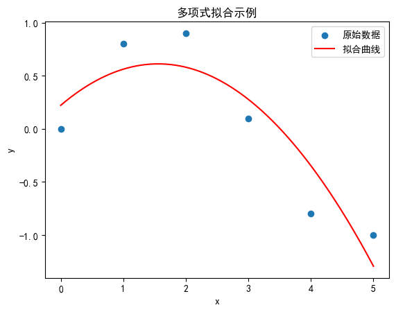

# 1.4 Numpy 与多项式计算

## 1.4.1 多项式的构造与运算

`numpy.poly1d`是 Numpy 中用于表示一维多项式的类。你可以通过系数来创建多项式，并使用这个类进行多项式的计算（如加法、乘法、求值等）。

```python
import numpy as np

# 创建一个多项式 2x^2 + 3x + 1
p = np.poly1d([2, 3, 1])

# 打印多项式
print(p)

# 计算多项式在x=5时的值
print(p(5))

# 多项式的加法
q = np.poly1d([1, 2])  # 多项式 x + 2
r = p + q
print(r)  # 输出新的多项式

# 多项式的乘法
s = p * q
print(s)  # 输出新的多项式
```

使用`numpy.poly1d`创建的多项式对象可以直接进行四则运算（加、减、乘、除），这些操作也会返回新的`poly1d`对象。
下面的代码展示了如何使用`numpy.poly1d`进行多项式的四则运算：

```python
import numpy as np
# 创建两个多项式
p = np.poly1d([2, 3, 1])  # 2x^2 + 3x + 1
q = np.poly1d([1, 2])  # x + 2

# 多项式加法
p_plus_q = p + q
print("p + q =", p_plus_q)
# 多项式减法
p_minus_q = p - q
print("p - q =", p_minus_q)
# 多项式乘法
p_times_q = p * q
print("p * q =", p_times_q)

# 多项式除法
# 除法在多项式运算中比较特殊，因为除法的结果可能包括商和余数
# numpy提供了numpy.polydiv函数，用于同时返回商和余数

q_div_p, remainder = np.polydiv(q, p)
print("q / p =", q_div_p)
print("余数 =", remainder)

# 如果对于除法你只需要商（不考虑余数），可以直接使用div函数，但是poly1d中没有直接的div方法，所以需要手动计算
q_div_p_only_quotient = np.polydiv(q, p)[0]
print("q / p (only quotient) =", q_div_p_only_quotient)
```

## 1.4.2 多项式上的复杂运算

`np.poly1d`对象提供了直接进行微分（求导）和积分的功能，这对于处理多项式的复杂运算非常有用，分别是`.deriv()`和`integ()`方法。
微分（求导）使用`.deriv(m=1,scale=1,rcond=None)`方法，其中`m`是导数的阶数,默认为 1，`scale`是缩放因子，用于在微分后调整多项式的系数（默认为 1，即不调整），`rcond`是条件数的阈值，在`poly1d`的微分下不涉及。

```python
import numpy as np

# 创建一个多项式
p = np.poly1d([2, 3, 1])  # 2x^2 + 3x + 1

# 微分（求导）
dp = p.deriv()
print("p 的一阶微分 =", dp)

# 二阶微分
d2p = p.deriv(m=2)
print("p 的二阶微分 =", d2p)
# 输出
# 一阶微分:
# 4 x + 3
# 二阶微分:
# 4
```

积分使用`.integ(m=1, k=0)`方法，其中`m`是积分的阶数，默认为 1，`k`是积分常数，默认为 0。

```python
# 对多项式进行一阶积分
ip = p.integ()
print("一阶积分 (积分常数为0):\n", ip)

# 对多项式进行一阶积分，并指定积分常数为1
ip_k1 = p.integ(k=1)
print("一阶积分 (积分常数为1):\n", ip_k1)

# 注意：连续积分时，积分常数会累加
ipp = p.integ(2)  # 这相当于两次应用.integ(k=0)
print("二阶积分 (积分常数为0):\n", ipp)

ipp_k2 = p.integ(2, k=2)  # 这相当于两次应用.integ()，但总积分常数为2
print("二阶积分 (总积分常数为2):\n", ipp_k2)
```

需要注意的是，在连续进行积分时，如果每次积分都指定了非零的积分常数，那么这些常数会累加。然而在实际应用中，通常只在第一次积分时指定一个积分常数，而在后续的积分中保持该常数为 0。
此外由于`np.poly1d`的积分和微分都是符号计算，因此他们不会产生数值误差，除非你在计算过程中使用了浮点数。
`np.poly1d`对象本身并没有直接提供多项式根的方法，因为这是一个表示多项式的类，而不是进行符号计算的库，但是我们可以使用 Numpy 的`numpy.roots()`函数来找到多项式（以系数形式给出）的根。

`numpy.roots()`函数接受一个包含多项式系数的数组（从最高项到常数项），并返回多项式的根，这些根可能是实数或复数，具体取决于多项式的性质。

```python
import numpy as np
# 创建一个多项式 2x^2 + 3x + 1
p = np.poly1d([2, 3, 1])
# 获取多项式的系数
coeffs = p.coef
# 使用 numpy.roots() 找到多项式的根
roots = np.roots(coeffs)
print("多项式的根 =", roots)
```

其中`coeffs`是多项式的系数数组,可以通过`numpy.coef()`获得，`numpy.roots(coeffs)`返回一个包含多项式根的数组。

需要注意的是，`numpy.roots` 函数返回的根是按照它们在复数平面上的位置来排序的，但这并不总是意味着它们按照模的大小或实部和虚部的某种顺序来排序。此外，如果多项式有重根，`numpy.roots` 也会返回相应的多个根（每个根都表示一次）。

还要注意的是，由于浮点数运算的精度限制，对于某些多项式（特别是高次多项式或具有复杂系数的多项式），`numpy.roots` 返回的根可能只是近似值，而不是精确值。因此，在需要高精度解的情况下，可能需要使用专门的符号数学库（如 `SymPy`）来求解多项式的根。

### 牛顿/切线法

补充一种如何从 0 开始计算一个方程数值解（不使用任何库函数）的方法。**Newton 法**，也称为切线法，是一种寻找函数零点的有效方法。其思路是从一个初始估计值开始，不断迭代更新，直到找到零点或达到预定精度。

假设我们想要求解方程 \(y=x^3-x-1\)的零点，我们可以从一个初始点 \(x_0\) 开始。Newton 法首先在\(x=x_0\)处求函数的切线，并找到切线与 x 轴的交点\(x_1\)作为下一个估计值,接着在\(x=x_1\)处重复这个过程，直到找到足够精确的零点。

```python
import numpy as np
def f(x):
    y=x**3-x-1#求根方程的表达式
    return y
def g(x):
    y=3*x**2-1#求根方程的导函数
    return y
def main():
    x_0=1.5 #取初值
    e=10**(-9) #误差要求
    L=0 #初始化迭代次数
    while L<100: #采用残差来判断
        x1=x_0-f(x_0)/g(x_0) #迭代公式,x(n+1)=x(n)-f(x(n))/f'(x(n))
        x_0=x1
        L=L+1 #统计迭代次数
        if abs(f(x_0)-0)<e:
            break
    print(f"x1={x1}") #输出数值解
    print(f(x_0)-0)  # 验证解的正确性
    print(f"L={L}") #输出迭代次数
if __name__ == '__main__':
   main()

```

解得：

```
x1=1.3247179572447898 1.865174681370263e-13 L=4
```

注意：Python 中不需要像 MATLAB 那样使用特殊函数来控制结果的精度，因为 Python 的浮点数运算本身就具有较高的精度。

### numpy.polyfit 多项式拟合

`numpy.polyfit`函数用于多项式拟合，它可以找到最小二乘法下的多项式系数，使得拟合的多项式与给定数据点之间的误差最小。

$$
p(x) = p_0 x^{\text{deg}} + p_1 x^{\text{deg}-1} + \cdots + p_{\text{deg}-1} x + p_{\text{deg}}
$$

其中`deg`是多项式的度数，该函数返回多项式的系数，从最高次项到常数项。

```python
import numpy as np
import matplotlib.pyplot as plt

# 示例数据：x值和对应的y值（可能含有噪声）
x = np.array([0, 1, 2, 3, 4, 5])
y = np.array([0, 0.8, 0.9, 0.1, -0.8, -1])

# 指定多项式的度数
deg = 2

# 使用numpy.polyfit进行多项式拟合
# 返回的coeffs是多项式的系数，从最高次项到常数项
coeffs = np.polyfit(x, y, deg)

# 使用numpy.poly1d创建多项式对象（可选）
p = np.poly1d(coeffs)

# 打印拟合得到的多项式
print("拟合得到的多项式:", p)

# 使用拟合得到的多项式进行预测（可选）
x_fit = np.linspace(min(x), max(x), 100)  # 生成一系列x值用于绘图
y_fit = p(x_fit)  # 计算对应的y值

# 绘图展示原始数据和拟合曲线
plt.scatter(x, y, label='原始数据')
plt.plot(x_fit, y_fit, color='red', label='拟合曲线')
plt.xlabel('x')
plt.ylabel('y')
plt.title('多项式拟合示例')
plt.legend()
plt.show()

```



- 在这个例子中，我们首先定义了 `x` 和 `y` 的示例数据（这里 `y` 值是模拟的，可能包含噪声）。
- 然后，我们指定了多项式的度数 `deg`，并使用 `numpy.polyfit` 函数对 `x` 和 `y` 进行拟合，得到了多项式的系数 `coeffs`。
- 接着，我们使用 `np.poly1d`（这是可选的）创建了一个多项式对象 `p`，它可以更方便地用于计算多项式的值或进行其他多项式运算。
- 最后，我们使用拟合得到的多项式对一系列 `x` 值进行预测，并绘制了原始数据点和拟合曲线。

需要注意的是，多项式拟合的度数 `deg` 是一个重要的参数，它会影响拟合的效果。

- 如果度数太低，可能无法很好地拟合数据的复杂变化；
- 如果度数太高，则可能会出现过拟合现象，即模型在训练数据上表现得很好，但在新的、未见过的数据上表现不佳。
- 因此，在实际应用中，通常需要通过交叉验证等方法来选择合适的度数。
